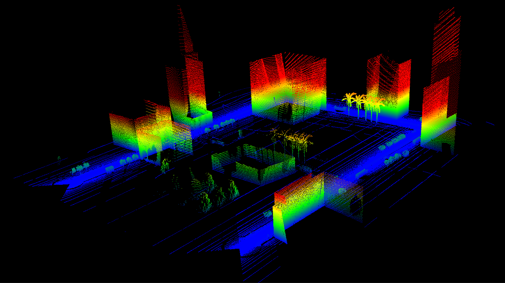

---
hide:
  - navigation
  - toc
---

# Welcome to Limulator Docs

# Limulator 

Limulator, i.e. LiDAR + Simulator, is a tool intended to simulate the lidar data generation and labelling process. Since then, it has come a long way to become a platform to actively support the development and testing of autonomous driving systems. As the development of autonomous systems picks pace, it has become absolutely critical to extensively test them in virtual environments before deploying them in public settings. Here we present one solution for that purpose: Limulator, a flexible simulator for point clouds, autonomous driving and much more.

## Simulator
The simulator is built upon Blender, which provides support for the computation of high-fidelity physics, and simulation rendering and controls all the actors. Limulator controls the trajectories of actors, sensors, cameras and platforms by providing a UI interface inside Blender.
    
    // Some grahic image explaining connection of blender and limulator 

To gain a perspective on the structure of the Limulator, some of the major components are listed below:

- **Scene**: A scene is a 3D real-world model, generated in a blend file.  

- **Platforms**: Platforms are all objects, dynamic and static, where sensors and cameras can be embedded. They can be chosen from the scene or imported from outside.

- **Sensors**: Sensors are static objects fixed on platforms. Currently, limulator only supports LiDar sensors.

- **Cameras**: Common as sensors, cameras are static objects fixed on platforms. Camera support in the limulator is implemented through the Blender camera module.

Check out some quick demos. 

    // Demo 1 (Car lidar) 

    // Demo 2 (Car camera)

    // Demo 3 (Drone lidar)

    // Demo 4 (Drone camera maybe?)