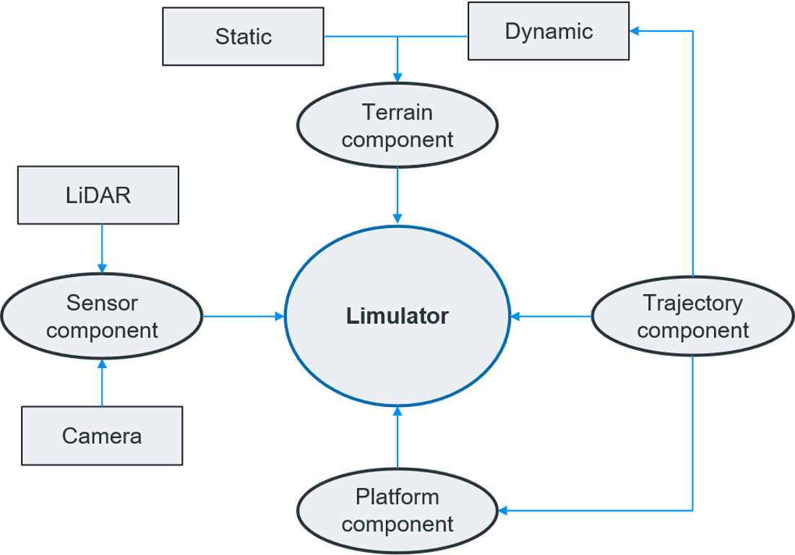

## Overview

### Limulator 
Lidar technology has been widely used to build 3D surface models. It can use several sensors available to generate user-required data,  needless to say, it is both time-consuming and expensive. 

Limulator is a wake of a new technology tool that builds realistic 3D surface models by simulation. Limulator stands for the combination of the words **LiDAR** and **simulator** thus becoming Limulator. Limulator has been developed as a generic solution for numerous simulation tasks, including autonomous driving systems, airborne altimetry, and others.
This software combines the models or mathematical equations to replicate the process of  LiDAR data generation. Majorly it works on three components: 3D model component, laser component, and LiDAR data generation.

### Why Limulator? 

The autonomous vehicle (AV) industry is just spreading its roots to reach the potential height of automation and self-driving vehicles. But it all comes down to the robust training of DL models and data generation.
Some of the challenges faced are :

1. A large amount of training data is required to train a deep network.
2. Imbalanced data leads to biases in the model in the training phase.
3. Capturing all possible scenarios in the real world and training the AV model on it is infeasible.
 
A high-fidelity limulator can bridge this gap in the training phase and tackle challenges.

- Various realistic scenarios can be generated using simulated data.
- It helps in reducing biases.
- The lack of real-world diversity can be filled by simulation i.e content gap.The simulated data depicts the real-world characteristics which can overcome the appearance gap.

The focus of the limulator :
 
                         (Flow chart with 2 levels)
                          Reference 5th slide PPT
                          
Previous contribution of limulator since 2007:

- Few publications such as Airborne Altimetric LiDAR.
- Won ISPRS awards
- Thousands of data download from limulator for educational and aerial platforms.
- Chandrayan LLRI simulation - Return waveform and point cloud simulation.

### Limulator Components 

There are four major components of a limulator:

 * [x] Terrain component  
 * [x] Trajectory component
 * [x] Platform component
 * [x] Sensor component

The terrain Component involves the formation of 3D static terrain imagery that resembles a real scene. The imagery includes great detailing which enables the possibility of scenario generation. The trajectory component on the other hand is responsible for adding dynamism to the static imagery. This is achieved by considering the acceleration and attitude change of moving objects. The platform component takes user input to narrow down the requirements such as platform type (mobile, stationary, ground-based, aerial), placement of the sensor on the platform, sensor type, orientation, trajectory, and so on. The sensor component emphasizes the type of the sensor i.e LiDAR or camera and takes input on sensor characteristics such as position, orientation, PRF, scan range, FOV, etc.

#### Terrain module
The terrain module consists creation of static objects. It has sub-components which include the creation of 3D assets, GIS layer, and DEM.

                                     The image on slide 9 is to be included here 

Step 1 - Analysis and quantification of the scene
An already existing scene is taken from dales data on which the size of terrain and surface structures are identified. The next procedure is to perform object quantification which involves class identification i.e car, building, traffic light, etc, and dimensions of the objects i.e height, width, etc.

Step 2 - Data Preparation 
Data prepared as follows -
 - Terrain heatmap and texture
 - The scene’s footprint and design are created in the file format OSM/ .shp/ Basemap data
 - Computer-generated architecture (CGA) rules file

Step 3 - Modelling in CityEngine
A mesh file is created in this step, is created as follows - 
 - Adjusting attributes to create more variations of 3D objects
 - Mapping and applying textures
 - A triangulated mesh file is generated and it is exported in .obj file format
#### Trajectory Module 
Here we will add dynamism to the static objects created in the previous step.
Three ways to apply dynamism are behavior modeling + trajectory, Nurbs path (blender), and Behavior modeling (blender). 

                                     The image on the slide 13 PPT

Blend file preparation 

                                     The Image on slide 16 to be inserted
#### Simulator / Platform setup
     - Slide 17
#### Platform Module
Configuration of the platform is taken by the user. The user is expected to input orientation, render period as well as platform movement data source. Platform trajectory is taken through a csv file.

                         Images of slide 18 , 19 and 20 to elaborate platform design
#### Sensor & Camera Module 
LiDAR sensor setup takes inputs from user with the help of an interactive UI. It takes sensor name, position, orientation, PRF, scan range, horizontal and vertical scanning patterns,and error parameters.
                                       
                                       Slide 22 LiDAR sensor img 

Camera sensor setup expects camera name, position, orientation, camera FPS, frame resolution and focal length as inputs.
                                        
                                        Slide 23 camera sensor img 
#### Limulate! 
The final step of the simulation process is limulating. Once the user clicks on **limulate** button the progress can be seen on the terminaland point cloud is generated.
                                       
                                       Slide 25 PPT images
### Limulator UI 

### Class Diagram
### Process Diagram
